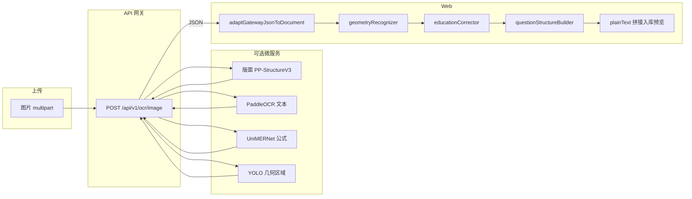

# 可插拔试卷 OCR 架构

面向 **GOT-OCR 2.0** 的管线：网关返回 JSON → 前端适配与规则后处理 → 结构化文档；上传入口不变。

## 目录（Web 侧）

| 路径 | 职责 |
|------|------|
| `apps/web/src/lib/ocr/types.ts` | `StructuredExamOcrDocument`、`NormalizedOcrBlock` |
| `apps/web/src/lib/ocr/gatewayAdapter.ts` | 网关 JSON → 规范化文档 |
| `apps/web/src/lib/ocr/geometryRecognizer.ts` | 几何/示意图块语义 |
| `apps/web/src/lib/ocr/educationCorrector.ts` | 教育场景 OCR 纠错 |
| `apps/web/src/lib/ocr/questionStructureBuilder.ts` | 题号切分 / 与公式提示合并 |
| `apps/web/src/lib/ocr/pluggableOcrPipeline.ts` | `runPluggableOcrPipeline` |
| `apps/web/src/lib/gatewayOcr.server.ts` | `postGatewayOcrImage` / `postGatewayOcrJson` |
| `apps/web/src/lib/gatewayOcr.functions.server.ts` | `gatewayOcrImage` / `gatewayOcrJson` |
| `apps/web/src/components/StructuredOcrPreview.tsx` | 折叠 JSON 预览 |
| `apps/web/src/lib/ocr/educationSymbolLexicon.ts` | 规则词典（△ABC、弧/步骤符等保守替换） |
| `apps/web/src/lib/ocr/subjectRepairPrompts.ts` | 数学 / 物理 / 化学 AI 修复系统提示 |
| `apps/web/src/services/ocr-ai-repair.server.ts` | `repairOcrTextWithAi`（词典预处理 → Chat Completions） |
| `apps/web/src/lib/ocrRepair.functions.server.ts` | `repairOfflineOcrTextWithAi` Server Fn |

**阶段 C（网关 JSON）**：`diagram_links`（题号 ↔ 示意图 `bbox`）、`blocks[].geometry_label`；前端映射为 `StructuredExamOcrDocument.diagramLinks`。

### 教育语义层（与「通用 OCR」的区别）

1. **规则词典**：在 `educationCorrector` 与 AI 修复入口共用的 `applyEducationSymbolLexicon`，处理高频误识且不调用模型。
2. **AI 语义修复**：可选；线下导入对话框勾选「入库前 AI 语义修复」后，在调用 `importOfflineExamFromDocument` 之前执行 `repairOfflineOcrTextWithAi`，使用与命题相同的 `AiRuntimePayload`（云端 Lovable 或本地 OpenAI 兼容接口）。
3. **后续扩展**：PP-Structure / 公式 / YOLO 仍在网关侧产出结构化 JSON；本层负责「文本语义」恢复，二者互补。

## 流程图

## PostgreSQL

迁移：`supabase/migrations/20260508190000_exam_ocr_artifacts.sql`

- 表 `exam_ocr_artifacts`：`exam_id`、`kind`（`gateway_raw` | `structured_v1` | `pipeline_snapshot`）、`payload jsonb`、`engine`、`source_filename`。
- 试卷入库成功后由应用层按需写入，便于追溯与渲染回放。

## Redis 缓存（建议）

| Key 模式 | TTL | 内容 |
|----------|-----|------|
| `ocr:gw:{sha256}` | 24h | 网关原始 JSON（大图需注意体积上限） |
| `ocr:structured:{sha256}` | 24h | `StructuredExamOcrDocument` 序列化结果 |

`sha256` 为图片字节或规范化 URL 的哈希。命中则跳过网关调用；未命中写回。部署时用同一 Redis 实例即可，键前缀可通过 `MPG_REDIS_PREFIX` 配置。

## 多 Agent 调用

- **编排 Agent**：仅负责路由（版面 → 检测 → 识别 → 合并），输出符合网关 JSON Schema。
- **教育纠错 Agent**：替换或增强 `educationCorrector`（保持输入输出为 `StructuredExamOcrDocument`）。
- **命题 Agent**：消费 `plainText` + `questions`，与现有「AI 识别并入库」一致。

建议契约：`services/agent-stub` 或网关增加 `POST /api/v1/ocr/agent`，body 为 `{ document: StructuredExamOcrDocument, task: "correct" | "segment" }`。

## 前端渲染

- 正文入库：仍使用拼接后的 `plainText`（与旧逻辑兼容）。
- 结构化预览：`StructuredOcrPreview` 展示 `structured.blocks` / `questions`；公式可用 KaTeX/MathJax 对 `formulaLatex` 渲染（可按块 `role === "formula"` 分支）。

## Docker

- 全栈：`docs/architecture/stack-docker.md`（`npm run docker:stack`）。
- OCR 服务为 `services/got-ocr-service`；网关仅转发，可换云 API 而保持 JSON 字段不变。

## 可插拔替换

1. **换云端 OCR**：实现与 `postGatewayOcrJson` 相同返回形状，或在前端 `runPluggableOcrPipeline` 的 `hooks.adapt` 中映射云厂商 JSON。
2. **换本地模型**：替换 `services/got-ocr-service` 内推理，保持 `/api/v1/ocr/image` 响应结构。
3. **保留旧调用方**：`gatewayOcrImage` + `postGatewayOcrImage` 仍返回聚合纯文本，未使用结构化管线。
