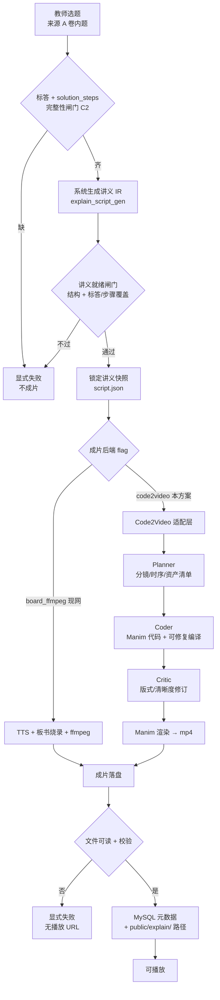

# 方案：讲义 IR → Code2Video 高质量讲解成片（v1）

- 状态：**待用户拍板**（技术路线已口头确认采用 Code2Video，本文件收口产品合同与验收）
- 日期：2026-08-12
- 性质：产品方案（可验收）；**不含**实现排期细表与架构终稿
- 上游合同（不得削弱）：
  - [`docs/prd-explain-video-contract-v1.md`](./prd-explain-video-contract-v1.md)（选题 → 系统讲义 → 系统成片；C1–C3、D11）
  - [`docs/prd-explain-video-v1.md`](./prd-explain-video-v1.md)（C4 flag、答案权威、现网安全）
- 技术路线裁决：**Code2Video**（Manim 可执行代码中心范式；Planner / Coder / Critic 三智能体），**不采用** manim-agent
- 上游开源参考（公开信息，集成细节标「待核实仓库」）：
  - 论文：arXiv:2510.01174
  - 项目页：https://showlab.github.io/Code2Video/
  - 仓库（公开）：https://github.com/showlab/Code2Video  
  - 说明：上游 README 示例模型名（Claude / Gemini 等）**不得**写入本产品源码或默认配置；本产品一律走设置「用途模型」+ OpenAI 兼容端点

---

## 1. 一句话目标与范围

**目标**：在现有「教师只选题 → 系统生成讲义 IR（闸门通过）→ 系统成片」合同不变的前提下，把**成片后端**从当前「板书烧录 + TTS + ffmpeg」升级为可选的 **Code2Video（讲义驱动 → Manim 代码 → 高质量讲解动画）**，成片仍落 `public/explain/`，元数据仍走 MySQL（D11）；模型与密钥全部走用户自备的云模型 API（OpenAI 兼容），不额外购买商业成片软件。

### 1.1 本版做

| # | 交付 |
|---|------|
| 1 | 保留现网讲义链路（AI 讲义 + 覆盖闸门 + `script.json` IR）为**唯一权威教学内容输入** |
| 2 | 新增可配置成片后端：`board_ffmpeg`（现网）\| `code2video`（本方案）；**Code2Video 路径默认关闭**（独立 flag，见 §4） |
| 3 | 将锁定标答 / `solution_steps` / 已过闸门讲义快照绑定为 Planner/Coder/Critic 的强制上下文；禁止编造答案或步骤 |
| 4 | Planner / Coder / Critic 三用途模型全部经 `purposeModelEntryIds` + OpenAI 兼容端点解析 |
| 5 | 依赖探测（Python / Manim / FFmpeg / LaTeX 等）纳入 readiness；缺依赖 → 拒入队、显式失败 |
| 6 | 状态机扩展用户可见中文阶段（规划中 / 写码中 / 审片修订中等），失败仍归「失败」 |
| 7 | 成片成功才写播放 URL；失败禁止静默改纯色片 / 空画面冒充成功（强化 C3） |

### 1.2 本版不做

1. 数字人出镜、整卷长片、实时互动答疑（继承合同非目标）。
2. 跳过讲义闸门、直接用「知识点一句话」调用上游「Any Query」模式成片（上游 demo 形态 ≠ 本产品主路径）。
3. 写死 Claude / Gemini / 任一供应商模型 id 或密钥文件进仓库。
4. 为凑成片修改 OCR / 命题 / 导入语义。
5. 来源 B（自定义规格）主路径交付（仍延后，合同已决）。
6. 将 manim-agent 作为并行正式后端（本版明确排除）。
7. 成片失败后把「仅讲义」或「仅 Manim 源码」标成讲解成功。
8. IconFinder 等需另购 API 的视觉素材主依赖（可选增强；缺则不得挡主路径，或显式失败——见开放决策 O3 相关风险，默认：**不依赖付费图标 API**）。

---

## 2. 目标架构

### 2.1 流水线（合同主路径 + Code2Video 成片）



### 2.2 权威数据流（禁止编造）

```text
卷内题（标答 + solution_steps）
        ↓ 选题即授权（合同 Q1）
讲义生成（只读上述事实 + 能力档硬约束）
        ↓ 覆盖闸门通过
ExplainScript IR（scenes: purpose / narration / onScreen / durationSec …）
        ↓ 唯一教学内容输入
Code2Video 适配层（注入冻结事实块，禁止「自由扩写答案」）
        ↓
Manim 源码 → 渲染 mp4 → 存储键 → 播放
```

**硬规则**：Code2Video 各智能体**不得**以「教学更完整」为由改写标答数值、结论或步骤顺序结论；允许的只是呈现方式（动画、排版、节奏）在讲义 IR 与能力档边界内的可视化实现。

---

## 3. 三智能体职责边界（本产品口径）

> 上游论文职责：Planner 组织讲义流与资产；Coder 合成可执行 Manim 并做范围化修复；Critic 用 VLM + 视觉锚点修订版式。  
> 下列为本产品**合同化边界**；上游脚本参数名 / CLI **待核实仓库**后由实现映射，产品不绑定具体命令字符串为验收条件。

### 3.1 Planner（规划）

| 项 | 口径 |
|----|------|
| **输入（强制）** | 已过闸门的讲义 IR 快照；题干预览；**冻结标答全文**；**冻结 solution_steps JSON**；能力档硬约束（幕数/字数/时长上界）；骨架 `scenePurposeSequence` |
| **输出** | 时序分镜计划（可与 IR scenes 1:1 或在档内合并/拆分，但须可追溯到 IR scene id）；板书元素清单；可选图引用（仅题目已有 `figure_refs`，禁止臆造 URL） |
| **允许** | 为动画可读性调整镜头节奏、板书出现顺序（在不改变结论前提下） |
| **禁止** | 新增未在标答/步骤/讲义中出现的结论、数值、选项对错；按题干「猜」能力档；跳过 IR 另起知识点作文 |
| **失败** | 规划结果与冻结事实不一致 / 超档 → 显式失败，不成片 |

### 3.2 Coder（写码与可修复编译）

| 项 | 口径 |
|----|------|
| **输入（强制）** | Planner 输出 + 同一冻结事实块 + 讲义 `onScreen`/`narration` |
| **输出** | 可执行 Manim（Community）场景代码；编译/渲染日志摘要（运维可读，默认层不展示） |
| **允许** | 在配置次数内根据报错做 ScopeRefine 类修复（次数进配置，禁止无限重试烧钱） |
| **禁止** | 为「跑通」删除题干关键条件或改答案；引入未声明的网络依赖下载；把失败渲染替换成纯色/静帧占位并继续标成功 |
| **失败** | 超次仍无法通过 Manim 渲染 → `失败`，无播放 URL |

### 3.3 Critic（视觉审片修订）

| 项 | 口径 |
|----|------|
| **输入** | 渲染预览帧 / 锚点图 + 讲义 onScreen 要点清单 + 冻结标答（用于「画面是否漏写要点」检查，而非重写答案） |
| **输出** | 版式修订指令或修订后代码补丁；通过/不通过裁决 |
| **允许** | 调整重叠、字号、边距、元素对齐；要求补上讲义已有但画面缺失的板书要点 |
| **禁止** | 以「更好教法」改写数学结论；在 VLM 不确定时默认放行（须 fail closed：关键要点缺失 → 不通过） |
| **失败** | 关键要点不可见或与冻结事实冲突 → 显式失败或退回 Coder（次数受配置上限） |

### 3.4 与「现有讲义 AI」的分工（避免双写权威）

| 阶段 | 权威 | 模型用途键（建议配置名，实现落 `explain-video.json`） |
|------|------|------------------------------------------------------|
| 讲义 IR | 现有 `handoutGeneration` + 覆盖闸门 | 已有 `explain_script_gen` |
| 动画规划 | Code2Video Planner | 新增 `explain_c2v_planner` |
| Manim 代码 | Code2Video Coder | 新增 `explain_c2v_coder` |
| 视觉审片 | Code2Video Critic（须支持视觉输入的条目；若条目无视觉能力 → **拒用该用途并显式失败**，禁止静默跳过 Critic） | 新增 `explain_c2v_critic` |

出题预留用途 `explain_item_gen` 本版不扩展。

---

## 4. 与现网集成点

### 4.1 路由 / UI

| 点 | 现网 | 本方案 |
|----|------|--------|
| 教师入口 | `/explain-practice`（`explain-video.json` → `routePath` / `navLabel`） | **不新开平行入口**；同一向导 |
| 主操作 | 选题后一键：讲义 → 成片（合同） | 不变；成片后端由配置决定 |
| 学生 | 仅 `ready` 可播 | 不变 |
| Flag 总开关 | `explain-video.json` → `enabled` | 保留；**另增** Code2Video 子开关（见下） |

### 4.2 ServerFn（现有，成片路径内切换）

现有（`apps/web/src/lib/explain.functions.server.ts`）保持对外形状，避免教师侧二次学习：

| ServerFn | 本方案影响 |
|----------|------------|
| `fetchExplainVideoReadiness` | 扩展探测项：当 `render.backend=code2video`（或等价键）时，增加 Python/Manim/LaTeX 等探测结果 |
| `runExplainScriptAndRender` | 讲义成功后分支：`board_ffmpeg` 走现网；`code2video` 走进适配层 |
| `getExplainPackageDetail` / `listExplainPackagesFn` | 返回扩展后的用户可见状态文案；可附带失败原因短句 |
| 选题/建包等 | 不因 Code2Video 改变答案权威规则 |

实现可新增**内部**模块（如 `explainVideoCode2Video*.server.ts`），但**禁止**单卷单题特例（C1）。

### 4.3 配置键（建议落入 `explain-video.json`，禁止散落魔法字符串）

| 键（逻辑名） | 默认 | 含义 |
|--------------|------|------|
| `enabled` | 现网已有 | 练习讲解总开关 |
| `render.backend` | `"board_ffmpeg"` | 成片后端；`"code2video"` 才启用本路线 |
| `code2video.enabled` | `false` | **双保险**：即使误改 backend，未显式打开也不跑 C2V（C4） |
| `code2video.maxCoderRepairAttempts` | 配置整数 | Coder 修复上限 |
| `code2video.maxCriticRounds` | 配置整数 | Critic 轮次上限 |
| `code2video.keepManimSources` | 见开放决策 O3 | 失败/成功是否保留 `.py` 等中间物 |
| `code2video.ttsMode` | 见开放决策 O2 | `reuse_explain_tts` \| `manim_builtin` \| `none_fail` |
| `modelPurposes` 增补 | — | `c2vPlanner` / `c2vCoder` / `c2vCritic` → 用途键字符串 |
| `modelPurposeLabels` | — | 设置页中文名 |
| `storageKeyTemplate` | 已有 `{packageId}/{bandId}/explain.mp4` | **成片路径模板不变**（D11） |
| `scriptJsonName` | `script.json` | 讲义 IR 文件名不变 |
| `messages.*` | 增补 C2V 缺依赖/模型文案 | 默认层零技术词 |

**Flag 默认关（验收强制）**：

- 新装/未拍板环境：`code2video.enabled=false` 且 `render.backend=board_ffmpeg`。
- `code2video.enabled=false` 时：不得要求本机安装 Manim/LaTeX 才能启动应用；不得让现网板书成片路径回归失败（C4）。

### 4.4 存储路径（D11，不改合同）

| 产物 | 位置 |
|------|------|
| 元数据 / 状态 / 播放指针 | MySQL 表 `explain_practice_packages`（及既有扩展列/JSON 字段策略，由实现按现网 store 演进；**禁止 BLOB 存成片**） |
| 成片 mp4 | `apps/web/public/explain/{packageId}/{bandId}/explain.mp4`（由 `publicKind` + `storageKeyTemplate` 解析） |
| 讲义 IR | 同目录 `script.json` |
| Code2Video 工作区（建议） | 同包目录下可配置子目录，如 `_work/c2v/`（中间代码、预览帧、日志）；**是否长期保留**见开放决策 O3 |
| 播放 URL | 仅 `ready` 时对教师/学生暴露；失败不得写有效播放指针 |

### 4.5 现网板书成片与 Code2Video 共存策略

| 模式 | 行为 |
|------|------|
| 仅现网 | 默认；行为与今日一致 |
| 仅 Code2Video | 运维打开双开关后，新作业走 C2V；历史 `ready` 资产仍可播 |
| 禁止静默互切 | 同一 package 渲染中途不得因 C2V 失败自动改走 `board_ffmpeg` 并标成功（违反 C3）；若产品将来要「可选降级」，必须**另开显式用户/运维动作**，本版不做自动降级 |

---

## 5. 模型与密钥

### 5.1 原则（拍板口径）

1. **全部** LLM/VLM 调用走工作区 AI 设置：用户添加的模型条目（OpenAI 兼容 base URL + API Key）+ `purposeModelEntryIds` 绑定。  
2. **禁止**在源码、默认 JSON、Docker 镜像内写死 Claude / Gemini / 厂商模型 id。  
3. **禁止**提交 `api_config.json` 类含密钥文件进 Git；上游若要求该文件，适配层须改为读本产品设置存储（`aiSettingsStore` / 等价）。  
4. 解析顺序对齐现网讲义：`环境变量覆盖（若项目已有约定）→ purposeModelEntryIds → 显式失败`（参考 `explainVideoAiResolve.shared.ts` 纪律）。  
5. Critic 用途所选条目必须具备视觉理解能力（产品验收：绑定纯文本-only 条目 → readiness 或入队失败，中文提示改选模型）。  
6. 用户要求「用自己的云模型 API」：本方案默认假设 OpenAI 兼容 Chat Completions（及视觉 messages 形态）；若某云厂商仅专有协议 → **本版不适配**，显式失败，不暗含多协议自动探测。

### 5.2 设置页展示（建议文案）

| 用途键 | 设置页标签 |
|--------|------------|
| `explain_script_gen` | 练习讲解 · 讲义生成（已有） |
| `explain_c2v_planner` | 练习讲解 · 动画规划 |
| `explain_c2v_coder` | 练习讲解 · 动画写码 |
| `explain_c2v_critic` | 练习讲解 · 动画审片 |

三键未绑齐且 `code2video.enabled=true` → readiness `ok=false`，拒入队。

---

## 6. 依赖与环境清单 + 验收探测

### 6.1 依赖清单

| 依赖 | 用途 | 备注 |
|------|------|------|
| Node 现网栈 | 向导 / ServerFn / MySQL | 已有 |
| FFmpeg | 现网板书路径；C2V 后处理/封装（若需要） | 已有探测 `MPG_EXPLAIN_FFMPEG_BIN` |
| TTS（say / piper） | 现网口播；C2V 是否复用见 O2 | 已有 |
| Python 3.x | 跑 Code2Video 适配 / Manim | **版本下限待核实仓库** `requirements.txt` |
| Manim Community | 渲染动画 | 上游文档指向 Community v0.19.0 一带；**精确 pin 待核实仓库** |
| LaTeX 发行版（如 MacTeX / TeX Live） | Manim 公式 | 缺则公式场景易失败 → 须探测或文档化；缺则显式失败 |
| 可选 Docker 镜像 | 固化 Python+Manim+FFmpeg+TeX | 见开放决策 O1 |
| 可选图标 API | 上游 IconFinder | **本版默认不依赖**；启用则另配且不得把密钥写入仓库 |

### 6.2 验收探测（readiness）

当且仅当 `enabled=true` 且 `code2video.enabled=true` 且 backend 指向 C2V 时，`fetchExplainVideoReadiness` 须增加（逻辑项）：

| 探测项 | 失败时用户可见原因（示例口径） |
|--------|--------------------------------|
| MySQL | 已有：数据库不可用… |
| 三用途模型已绑定且可解析 | 请先在设置 → 用途模型中为动画规划/写码/审片选择模型 |
| Critic 条目支持视觉 | 审片模型不支持看图，请改选 |
| Python 可执行 | 未检测到动画渲染运行时… |
| Manim 可 import / `manim --version`（具体命令待核实） | 未检测到动画引擎… |
| FFmpeg | 已有 |
| LaTeX（若配置 `code2video.requireLatex=true`） | 未检测到公式排版组件… |
| TTS（仅当 `ttsMode=reuse_explain_tts`） | 已有 TTS 文案 |

**探测失败**：入口不可用或一键流水线拒入队；**禁止**半残运行出「可播放」。

### 6.3 「不额外买软件」边界（产品声明）

- 允许：开源 Manim / FFmpeg / TeX / 用户自有云 API 额度。  
- 不允许把本方案验收绑定到：必购数字人 SaaS、必购 IconFinder、必购某一家闭源成片套件。  
- 云模型费用由用户自备 API 承担，产品只消费用途绑定。

---

## 7. 状态机扩展（用户可见中文名）

继承合同中文阶段，并在「成片中」内部细分（默认层可折叠为「成片中」，高级/详情可展开子阶段）。**对教师默认层仍禁止直出内部码。**

| 用户可见 | 内部状态码（建议） | 含义 | 下一动作 |
|----------|-------------------|------|----------|
| 草稿包 | `draft` | 已选题，答案权威未齐 | 补全后重试 |
| 生成讲义中 | `generating_handout` / 现网 `queued_script` 对齐实现 | 系统生成讲义 | 等待 |
| 讲义就绪 | `handout_ready` / `script_ready` | 讲义闸门通过 | 自动成片 |
| 成片中 | `queued_render` | 总阶段（可笼统展示） | 等待 |
| └ 动画规划中 | `c2v_planning`（子状态或 progress 字段） | Planner | 等待 |
| └ 动画写码中 | `c2v_coding` | Coder | 等待 |
| └ 动画审片中 | `c2v_critic` | Critic | 等待 |
| └ 动画渲染中 | `c2v_rendering` | Manim 出片 | 等待 |
| 可播放 | `ready` | 有有效播放路径 | 预览 |
| 失败 | `failed` | 任一步失败 | 显式重试 |

**合法转移（相对合同不削弱）**：

- 禁止：跳过讲义就绪 → 可播放  
- 禁止：失败 → 可播放（无重试成功）  
- 禁止：C2V 任一步失败却写播放 URL  
- 禁止：无有效 `defaultAbilityBandId` 入队  
- 子状态仅允许在 `queued_render` 生命周期内前进或落入 `failed`；不得从子状态直接标 `ready` 而不经成片校验  

> 实现可将子状态存 `progress`/`phase` 字段而主状态仍用现网枚举，避免一次大爆炸改表；**产品验收认用户可见文案与禁止非法跳转**，不强制某一列名。

---

## 8. 里程碑 M0–M3 与验收勾选

### M0 — 契约与探测（不成片对外）

**交付**：配置键骨架；`code2video.enabled=false` 默认；用途键与设置页标签；readiness 探测接口形状；状态文案表；适配层空壳 + 单测（flag off 零回归）。

**验收**：

- [ ] flag / backend 默认不走 C2V；现网练习讲解主路径行为与约定测试不受影响（C4）。  
- [ ] 配置缺省齐全；无单卷单题硬编码（C1 扫描范围纳入新增文件）。  
- [ ] 文档列出依赖与探测项；命令级 pin **标注待核实仓库**处不假装已冻结。  
- [ ] 用途模型三键出现在设置「用途模型」，未绑定不导致应用启动崩溃。

### M1 — 最小闭环（单题、默认档、显式失败）

**交付**：讲义闸门通过后 → Planner → Coder →（可先弱化 Critic 轮次=0 仅当配置允许且**仍须**要点覆盖校验器）→ Manim → mp4 落盘 → `ready`。

**验收**：

- [ ] 教师选题 + 一键：讲义 → C2V 成片 → 可播放预览。  
- [ ] 缺标答/步骤 → 拒讲义，不进入 C2V。  
- [ ] 讲义覆盖闸门失败 → 不成片。  
- [ ] 故意卸掉 Manim/Python → `失败`，无播放 URL，中文短因。  
- [ ] 三用途模型走 `purposeModelEntryIds`；断网/错 key → 显式失败。  
- [ ] 成片路径符合 `storageKeyTemplate`；MySQL 有元数据（D11）。  
- [ ] **禁止**失败时生成纯色/空板书片并标成功。

### M2 — Critic 闭环 + 质量闸门强化

**交付**：Critic 视觉轮次；要点可见性检查；修复次数上限；工作区产物策略按 O3；用量/耗时日志（运维）。

**验收**：

- [ ] Critic 绑定非视觉模型 → 拒入队或失败（不静默跳过）。  
- [ ] 抽样：画面 onScreen 要点覆盖讲义/标答关键片段（配置化检查器，非「模型自称一致」）。  
- [ ] 超修复次数 → 失败，可重试；不自动降级 board_ffmpeg。  
- [ ] 能力档时长/幕数约束在 C2V 路径仍强制。

### M3 — 运维形态与正式可开

**交付**：按 O1 落地本机或 Docker 一种**推荐**安装文档；批量/并发上限配置；失败可观测；与合同学生侧布置衔接（若 M2 课堂链已存在则只接线，不改阅卷语义）。

**验收**：

- [ ] 按文档在干净环境从零装到 readiness=ok（一种官方路径即可）。  
- [ ] 并发上限生效；费用相关风险可配置熔断（拒入队，非静默缩画质冒充成功）。  
- [ ] flag 关闭回归清单通过。  
- [ ] 开放决策 O1–O3 已写入配置默认值并与文档一致。

**禁止**：未完成 M0 宣称可上线；未完成 M1 对外宣传「高质量动画已可用」。

---

## 9. 风险与降级策略

| 风险 | 策略（须显式，禁止静默） |
|------|--------------------------|
| 模型编造答案进动画 | 冻结事实块注入；讲义覆盖闸门；Coder/Critic 禁止改结论；抽检 |
| Manim/LaTeX 环境脆弱 | readiness 拒入队；失败中文原因；文档化一种安装路径 |
| 上游绑定 Claude/Gemini 心智 | 产品层强制 OpenAI 兼容用途模型；质量差异由用户自选模型承担，不暗换供应商 |
| 耗时与费用高 | 配置修复/审片轮次上限；队列并发上限；超时 → 失败 |
| C2V 失败想「至少有片」 | **本版禁止**自动改 board_ffmpeg 或纯色片标成功；仅允许：显式失败 + 用户重试；若未来要降级，须独立开关且教师可知 |
| Critic 误杀 / 漏放 | 关键要点检查器配置化；不确定 → 不通过（偏严） |
| 图标 API / 外网资产 | 默认关闭；开启失败不得用无关图凑数 |
| 与现网 TTS 口型/时长不一致 | 由 O2 拍板；无论哪种，失败都不得空成功 |
| 仓库 API 漂移 | 适配层隔离；升级上游需回归 M1 勾选 |

**降级总则（合同 C3）**：任何降级必须**对用户可见为失败或显式二次确认**；禁止「看起来有视频」的假成功。

---

## 10. 需用户拍板的 3 个开放决策

### O1 — 渲染运行环境：本机 vs Docker

| 选项 | 含义 | 倾向 |
|------|------|------|
| **A. 本机 Python+Manim** | 开发机直接装依赖；与现网 ffmpeg/TTS 同机 | 迭代快；环境漂移风险高 |
| **B. Docker 专用渲染容器** | Web 仍本机；渲染打到容器；TeX/Manim 固化 | 可复现；需 Docker 与卷挂载 |
| **C. 先 A 后 B** | M1 本机闭环，M3 提供官方镜像 | 常见工程折中 |

**请拍板：A / B / C。**  
未拍板前实现不得假设「全员已装 Docker」或「全员本机 TeX」。

### O2 — 口播 TTS：继续现网 vs Code2Video/Manim 侧

| 选项 | 含义 | 倾向 |
|------|------|------|
| **A. 复用现网 TTS**（say/piper） | C2V 出画面轨，口播仍走现网合成再混流 | 与听力/讲解运维一致；混流要接 ffmpeg |
| **B. Manim/上游自带语音链路** | 若仓库支持（**待核实**）则用其语音 | 可能省适配；易与现网音色分裂；仍须 OpenAI 兼容或本地引擎，禁止写死云厂商 |
| **C. 无口播则失败** | 暂时只接受「画面+口播」完备产物 | 最严；缺 TTS 直接失败（符合「高质量讲解」） |

**请拍板：A / B / C。**  
约束：无论选哪项，**禁止**无口播纯动画却标「讲解完成」除非用户显式选择「仅画面」——而「仅画面」**本版不做**。

### O3 — 失败/成功后是否保留 Manim 源码供人工改

| 选项 | 含义 | 倾向 |
|------|------|------|
| **A. 始终保留** `_work/c2v/*.py`（及日志） | 便于运维/高级用户手改后重渲（重渲若做，须仍过事实闸门） | 可调试；占磁盘 |
| **B. 仅失败保留** | 成功只留 mp4+script.json | 折中 |
| **C. 从不保留** | 只留成片与 IR | 最干净；排障难 |

**请拍板：A / B / C。**  
补充：即使保留源码，**人工改码重渲**若进入产品，须另开「高级重渲」且再次校验冻结事实；本版 M1 可不做人工重渲 UI，只定落盘策略。

---

## 11. 与上游 Code2Video 的接口假设（待核实仓库）

以下为集成假设，**核实前不得写成实现死命令**：

1. 上游入口偏向「知识点字符串 → 全自动三智能体」；本产品须改为「**讲义 IR + 冻结标答/步骤 → 三智能体**」，即加适配层，而不是把卷内题当成自由 topic query。  
2. 上游 `api_config.json` / shell 中的模型名须替换为：本产品解析出的 `baseUrl`、`apiKey`、`model`。  
3. 上游输出目录（如 `CASES/...`）须映射到本包 `public/explain/{packageId}/{bandId}/_work/c2v/`，最终 mp4 **规范化复制/转码**为 `explain.mp4`。  
4. 并行组数、单次概念数等上游参数 → 落入 `explain-video.json`，禁止源码写死。  
5. 许可证与依赖清单：合入或 submodule 前须合规审阅（产品要求：不引入强制付费 SaaS）。

**核实清单（实现 M0 产出）**：

- [ ] 确认 Python / Manim 版本 pin  
- [ ] 确认是否自带 TTS、输出文件名约定  
- [ ] 确认 Critic 调用的视觉 API 是否可替换为 OpenAI 兼容视觉接口  
- [ ] 确认无 IconFinder 时能否关闭资产下载  
- [ ] 确认官方安装步骤与本仓库 `docs/` 可转写内容

---

## 12. 总验收摘要（拍板后冻结）

- [ ] 合同主路径不改：只选题 → 系统讲义 → 系统成片。  
- [ ] C1/C2/C3/C4/D11 全部仍成立。  
- [ ] Code2Video **默认关**；打开后模型全走用途绑定 + OpenAI 兼容。  
- [ ] 不采用 manim-agent。  
- [ ] 失败显式；无纯色片假成功；无自动静默降级。  
- [ ] O1/O2/O3 用户三选一写入配置默认值后方可宣称 M3 完成。

---

## 13. 请用户当页回复

请直接回复：

1. **方案总体**：同意 / 驳回（附修改点）  
2. **O1**：A / B / C  
3. **O2**：A / B / C  
4. **O3**：A / B / C  

三项开放决策未齐前，实现不得自行猜测默认开 Docker、不得写死供应商模型、不得启用自动降级成片。
