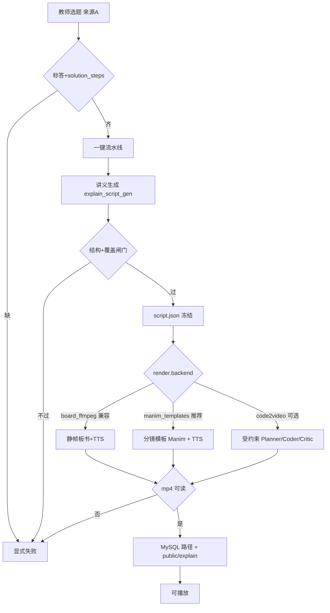

# 最优方案：练习讲解成片（对本仓重写，v1）

- 状态：**已拍板**（2026-08-12，稳妥推荐组合；见 §11 / §12）
- 日期：2026-08-12
- 性质：产品方案（可验收）；**不含**实现排期细表
- 上游合同（不得削弱）：
  - [`docs/prd-explain-video-contract-v1.md`](./prd-explain-video-contract-v1.md)（选题 → 系统讲义 → 系统成片；C1–C4、D11）
  - [`docs/prd-explain-video-v1.md`](./prd-explain-video-v1.md)
- 相对旧稿：
  - 现网「板书 PNG + TTS + ffmpeg」**不得**再被当成「高质量动画讲解」终态
  - [`docs/prd-explain-video-code2video-v1.md`](./prd-explain-video-code2video-v1.md) 中「直接把上游 Code2Video Any-Query 三智能体当主成片」**降级为可选增强层**，不是本仓最优主路径
- 技术路线裁决（本版）：**讲义 IR 权威 + 分镜模板 Manim 主成片 +（可选）Code2Video 智能体增强**；禁止 manim-agent 正式后端

---

## 0. 为什么要重写（现网与旧方案的错位）

| 错位 | 事实 | 产品后果 |
|------|------|----------|
| 成片形态错了 | 现网唯一成片 = 静帧板书 PNG + TTS + `fps:1` concat | 体感「只有声音/假动画」，违背合同「动画视频」语义 |
| 产品主路径未对齐合同 | UI 仍强制「锁定」「选能力档」；状态直出内部码 | 教师负担与合同「只选题」冲突 |
| 上游范式错配 | Code2Video 面向「任意知识点 query」自由扩写成片 | 本产品权威是**已过闸门的 `ExplainScriptV1` + 冻结标答/步骤**，禁止自由改答案 |
| 一跳上游成本过高 | 上游依赖 Python/Manim/LaTeX + 强 LLM/VLM +（可选）图标 API | 未对齐合同 UI / 讲义权威前，直接接入易变成「能跑 demo、不能进教学验收」 |
| 讲义侧其实已对 | AI 讲义 + 覆盖闸门 + `script.json` + MySQL + 用途模型 | **应保留**；问题在成片后端与教师面，不在讲义权威链 |

**结论**：最优方案不是「扔掉现网、整仓换成 Code2Video」，而是 **先把合同主路径做对，再用「IR → 确定性 Manim 模板」做主成片，Code2Video 仅作配置可选的增强层**。

---

## 1. 一句话目标

教师**只选题** → 系统生成并通过讲义闸门 → 系统按讲义 IR **渲染可验收的讲解动画成片**（落 `public/explain/`，元数据 MySQL）。成片以**分镜目的驱动的 Manim 模板**为主路径；全量 Code2Video 三智能体为高级可选；现网静帧板书仅作兼容/应急，**不得标为优质终态**。

---

## 2. 本版做 / 不做

### 2.1 做

| # | 交付 |
|---|------|
| 1 | **合同 UI**：选题后一键；默认 `defaultAbilityBandId`；中文阶段名；默认层不直出内部 status /「锁定」技术词 |
| 2 | **保留讲义权威链**：AI 讲义 + 标答/步骤覆盖闸门 + `script.json`（`ExplainScriptV1`）为唯一教学内容输入 |
| 3 | **成片阶梯（配置驱动）**：`board_ffmpeg`（兼容）\| `manim_templates`（**推荐主路径**）\| `code2video`（可选增强）；缺依赖 / 未绑模型 → 显式失败，**禁止静默降级冒充成功** |
| 4 | **`manim_templates`**：按配置 `scenePurposes`（`read_stem` / `idea` / `step` / …）映射到固定 Manim Scene 族；口播复用现网 TTS（say/piper）；画面为真动画（书写、高亮、分步显现），数值与结论只读 IR |
| 5 | **`code2video`（可选）**：仅在 flag 开且用途模型齐全时，对「模板无法表达」的分镜做受约束代码生成；仍注入冻结事实，禁止改标答 |
| 6 | readiness：FFmpeg +（模板/C2V 路径）Python/Manim/LaTeX；用途模型探测；失败中文短句 |
| 7 | D11 / C3：成功才写播放 URL；无有效 mp4 不得 `ready` |

### 2.2 不做

1. 数字人、整卷长片、实时答疑。
2. 跳过讲义闸门的「知识点一句话」Any-Query 成片作为主路径。
3. 源码写死供应商模型 / 密钥 / 单卷单题特例。
4. C2V 或模板失败后**静默**改静帧板书并标成功。
5. 把静帧板书宣传为「高质量动画」验收标准。
6. manim-agent 正式后端；IconFinder 等付费素材作为主依赖。
7. 来源 B 主路径（仍延后）。

---

## 3. 目标架构（最优）

### 3.1 端到端



### 3.2 权威数据流（不变）

```text
卷内题（标答 + solution_steps）
  → 讲义 IR（scenes: purpose / narration / onScreen / durationSec / figureRefId?）
  → 成片后端只做「呈现」；禁止改答案与步骤结论
```

### 3.3 为何主路径是模板 Manim，而不是直接 Code2Video

| 维度 | `manim_templates`（推荐） | 全量 Code2Video | 现网 `board_ffmpeg` |
|------|---------------------------|-----------------|---------------------|
| 与 IR 契合 | 强：`scenePurposes` 一一映射 | 弱：上游按知识点自由规划 | 有板书无动画 |
| 答案保真 | 最高（代码路径确定） | 依赖提示约束，仍有改写风险 | 高，但质素差 |
| 运维成本 | 中（一次装 Manim） | 高（三模型+编译修复环） | 低 |
| 教学观感 | 可验收的「分步动画讲解」 | 上限高、方差大 | 不合格终态 |
| 配置纪律 | 模板表进配置，禁硬编码题型特例 | 用途模型三键 | 已有 |

**对本仓最优**：K12 卷内题讲解要的是**保真 + 稳定可复现**，不是开放式科普片。IR 已经给出分镜；最优是「渲染 IR」，不是「再发明一遍讲义」。

---

## 4. 成片三档（配置合同）

配置建议落在 `explain-video.json`（键名实现可微调，语义不变）：

| 键 | 语义 |
|----|------|
| `render.backend` | `board_ffmpeg` \| `manim_templates` \| `code2video` |
| `render.backend` **配置默认值** | **M1 验收前** = `board_ffmpeg`；**M1 验收通过后**改为 `manim_templates`（见 §11 已拍板） |
| `render.allowBackendFallback` | **必须为 `false`（已拍板）**；禁止失败静默换后端 |
| `render.manimRuntime` | `local` \| `docker`（**两者可配，已拍板**）；readiness 只探测当前所选 |
| `manimTemplates.enabled` | 与 backend 一致时启用 |
| `manimTemplates.sceneTemplateMap` | `scenePurpose → templateId`（只进配置） |
| `code2video.enabled` | 默认 `false`；与 backend=`code2video` 同时满足才跑 |
| `modelPurposes.c2vPlanner/Coder/Critic` | 仅 C2V 档需要；未绑 → 拒入队 |

**产品主路径 vs 配置默认（勿混淆）**：

- **产品终态 / 优质验收**：`manim_templates`（C2V 仅可选增强）。
- **合并后至 M1 验收前的配置默认**：仍为 `board_ffmpeg`，避免未装 Manim 时全站新包硬失败；文案不得把该默认宣传为「高质量动画终态」。
- **禁止**：声称走模板/C2V 却失败后自动改静帧并标 `ready`。

### 4.1 `board_ffmpeg`（兼容层）

- **定位**：M1 验收前的配置默认成片；验收后降为显式兼容 / 历史包回放。
- **验收**：有可读板书 + 口播；**不算**「动画讲解」产品终态验收。
- **纪律**：`burnOnScreenText` 关则拒片；禁止纯色/空画面。

### 4.2 `manim_templates`（产品主成片；M1 验收后切为配置默认）

| 项 | 口径 |
|----|------|
| 输入 | 过闸门 `ExplainScriptV1` + 能力档硬约束 |
| 映射 | 每个 `scene.purpose` → 配置声明的模板（书写题干、分步推导、高亮易错、揭示标答、总结） |
| 动画 | 至少：逐步显现 `onScreen`、当前步高亮、镜间过渡；禁止整镜静图冒充 |
| 口播 | 复用现网 TTS（say / piper，配置 `ttsEngine`）；音画对齐按 `durationSec` 与音频实测时长取合法合成策略（策略进配置，禁止静默裁掉标答镜） |
| 运行时 | `render.manimRuntime`：`local` 或 `docker`（可配） |
| 图 | `figureRefId` 有则按现有 figure 解析挂载；无则不得瞎补图 |
| 失败 | 缺模板映射 / Manim 渲染失败 / 无 mp4 → 显式失败（不降级） |

### 4.3 `code2video`（可选增强；默认关）

| 项 | 口径 |
|----|------|
| 触发 | flag 开 + backend 指定 + 三用途模型已绑 + Critic 具备视觉能力（否则拒用，不跳过） |
| 输入 | **同一**讲义 IR + 冻结标答/步骤块；禁止 Any-Query 主路径 |
| 职责 | Planner 仅做呈现规划；Coder 写/修 Manim；Critic 版式；**不得**改答案 |
| 素材 | 默认不依赖付费 Icon API |
| 失败 | 显式失败；本版不自动降到模板或静帧 |

---

## 5. 教师面与状态机（必须先对齐合同）

继承合同 §2 / §5，本方案**强制实现**（相对现网债务）：

| 要求 | 口径 |
|------|------|
| 必做 | 仅选题；一次主操作启动讲义→成片 |
| 能力档 | 默认配置 `defaultAbilityBandId`（现为 `L2`）；选档仅高级 |
| 「锁定」 | 选题即授权；UI 不展示技术「锁定」为主按钮 |
| 默认文案 | 中文阶段名；内部码不进默认层 |
| 来源 B | 次路径/延后，不与主路径对等抢位 |

成片阶段用户可见可细化为（仍映射内部码，默认只显示中文）：

| 用户可见 | 含义 |
|----------|------|
| 生成讲义中 | 讲义 AI / 闸门 |
| 讲义就绪 | 可折叠一瞬 |
| 成片中 | 含「渲染画面 / 合成音画」；C2V 开时可再拆「规划/写码/审片」进高级 |
| 可播放 / 失败 | 同合同 |

---

## 6. 模型与密钥纪律

| 用途 | 键（建议） | 何时必需 |
|------|------------|----------|
| 讲义 | `explain_script_gen`（已有） | 讲义 AI 模式 |
| C2V Planner/Coder/Critic | `explain_c2v_*` | 仅 `code2video` 后端 |
| 模板 Manim | **不需要** LLM 写代码 | — |

一律：`purposeModelEntryIds` + OpenAI 兼容；环境变量可覆盖；未配置 → 显式失败。禁止上游 `api_config.json` 式密钥进仓库。

---

## 7. 存储与安全（不削弱）

- MySQL：包状态、能力档、script 快照、存储键、错误码；**非**成片 BLOB（D11）。
- 文件：`public/explain/{packageId}/{bandId}/explain.mp4` + `script.json`（可另存 manim 源码于 `_work/`，**不得**单独标成功）。
- C4：`enabled=false` 或讲解总开关关 → 不影响试卷库等主路径；C2V/Manim 未装不得拖垮「仅讲义」以外的无关功能。

---

## 8. 验收标准（拍板后可测）

### 8.1 合同主路径

1. 教师只选题 + 一键 → 讲义过闸 → 成片可播；默认不点锁定/选档。
2. 缺标答/步骤 → 拒讲义；讲义覆盖失败 → 不成片。
3. 默认层只有中文阶段；无内部 status 直出。

### 8.2 成片质素（`manim_templates`）

1. 成片中存在**时间轴上的画面变化**（非单帧静图循环冒充）。
2. 口播与分镜顺序一致；标答/关键步骤可见于画面或字幕区（来自 IR，非编造）。
3. 故意改坏标答注入 → 覆盖闸门或成片前校验失败。

### 8.3 失败与降级

1. 指定 backend 缺依赖 → 拒入队/失败，**不**自动换 backend。
2. 无有效 mp4 → 不得 `ready`、不得给播放 URL。
3. `code2video` 关时，未装 C2V 依赖不得影响 `manim_templates` / 兼容层路径的 readiness 结论（按当前 backend 探测）。

### 8.4 回归

1. 历史 `ready` 包仍可播。
2. `board_ffmpeg` 在显式配置下仍可出片（兼容验收，非优质终态）。

---

## 9. 落地顺序（已拍板：M0 与 M1 同迭代必做，均为最小可验收集）

| 里程碑 | 内容 | 完成定义 |
|--------|------|----------|
| **M0**（同迭代） | 合同 UI 最小集：选题一键、默认 L2、中文阶段名、失败短句；默认层不直出内部码 / 必点「锁定」 | 教师面与合同一致 |
| **M1**（同迭代） | `manim_templates` 最小可播：至少一骨架（如填空计算）覆盖 `read_stem`/`idea`/`step`/`answer` 真动画 + TTS 混流 + `local`\|`docker` readiness | 显式配置 `backend=manim_templates` 可出真动画；**验收通过后再改配置默认** |
| **M1′** | 配置默认从 `board_ffmpeg` → `manim_templates` | **不在本迭代自动执行**。运维验收 Manim 模板成片后，**手动**改 `explain-video.json` 的 `render.backend`；禁止代码静默切换。本迭代默认保持 `board_ffmpeg`。readiness 可返回 `manimAvailable` 供 `/explain-practice` 高级区只读提示「可切模板成片」，**无第二生成入口**。 |
| **M2** | 模板覆盖配置中全部 `scenePurposes` + 图挂载 | 主骨架题型可验收 |
| **M3** | （可选）`code2video` flag 增强层 | 复杂镜可开；默认关 |
| **M4** | `board_ffmpeg` 仅显式兼容档 | 文档与设置不再称为优质终态 |

> **已拍板**：不得跳过 M0/M1 直接做 M3。同迭代只要求最小集，不要求一次做完全题型模板或 C2V。

---

## 10. 与旧 Code2Video 专稿的关系

| 旧稿主张 | 本最优方案（已拍板） |
|----------|----------------------|
| 成片后端主推 Code2Video 三智能体 | 主推 **IR → Manim 模板**；C2V 为可选增强（默认关） |
| 双后端 `board_ffmpeg` \| `code2video` | **三档**；静帧为过渡默认与兼容 |
| 开放决策待定 | 以 §11 / §12 为准 |

旧稿 [`prd-explain-video-code2video-v1.md`](./prd-explain-video-code2video-v1.md) 保留作「增强层详设」参考；**产品主裁决以本文为准**。

---

## 11. 已拍板决议（稳妥推荐组合）

| 编号 | 议题 | 决议 |
|------|------|------|
| **R1** | 主成片形态 | **Manim 分镜模板**为产品主成片；**Code2Video 仅可选增强**（默认关，进 M3） |
| **R2** | 失败降级 | **禁止**失败自动降到静帧并标成功（`allowBackendFallback=false`）；无有效 mp4 不得 `ready` |
| **R3** | Manim 环境 | **本机 / Docker 两者可配**（`render.manimRuntime` = `local` \| `docker`）；按所选做 readiness，缺则显式失败 |
| **R4** | 新包配置默认 backend | **M1 验收前暂留 `board_ffmpeg`**；验收通过后改为 `manim_templates`（M1′） |
| **R5** | M0 与 M1 | **同迭代必做**；均为最小可验收集（见 §9） |
| **R6** | TTS | **复用**现网 say/piper（与模板/C2V 画面合成） |

开放题已关闭；若日后改判，须在 §12 追加一行并说明废止哪条 R*。

---

## 12. 拍板记录

| 日期 | 决议 |
|------|------|
| 2026-08-12 | 采用稳妥推荐组合写入本文：**R1** 模板主成片、C2V 可选；**R2** 禁止失败降级标成功；**R3** Manim 本机/Docker 可配；**R4** 默认 backend 验收前仍 `board_ffmpeg`，M1 通过后切模板；**R5** M0+M1 同迭代最小集；**R6** TTS 复用现网。 |
| 2026-08-12 | **M0+M1 最小集已落地代码**（未切 M1′ 默认 backend）：一键选题流水线 + 中文阶段；`render.backend` 分发；`manim_templates` 确定性脚本 + TTS；默认仍 `board_ffmpeg`。 |
| 2026-08-19 | **本迭代不执行 M1′**：默认仍 `board_ffmpeg`。验收 Manim 后由运维手动改 `render.backend=manim_templates`。全站生成入口仅 `/explain-practice`；师生布置/作业页只播 ready 包。 |

---

## 13. 生成入口（硬约束）

全站**只允许** [`explain-video.json` `routePath`](../apps/web/src/config/explain-video.json)（现为 `/explain-practice`）一键生成讲义视频。

| 表面 | 允许 |
|------|------|
| `/explain-practice` | 单一主 CTA「生成讲解」；高级可选强制重新生成、多档进度 |
| 教师布置 | **禁止**生成按钮 / render / handout；作业只挂钩已有卷 |
| 学生作业 | **禁止**生成；有 ready 包则按档案绑档播放，无片仅「暂无讲解」 |

同题同档二次一键（未勾选强制重新生成）须复用 `status=ready` 包，不得新建。

---

*本文为对本仓「练习讲解视频」的最优产品收口；实现须遵守 C1–C4、D11 与通用试卷内容治理，禁止硬编码单卷单题与静默兜底。*
